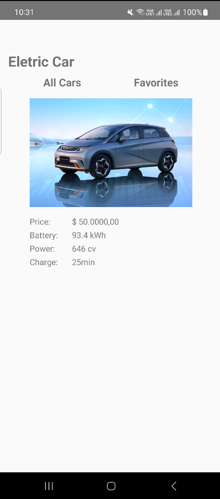
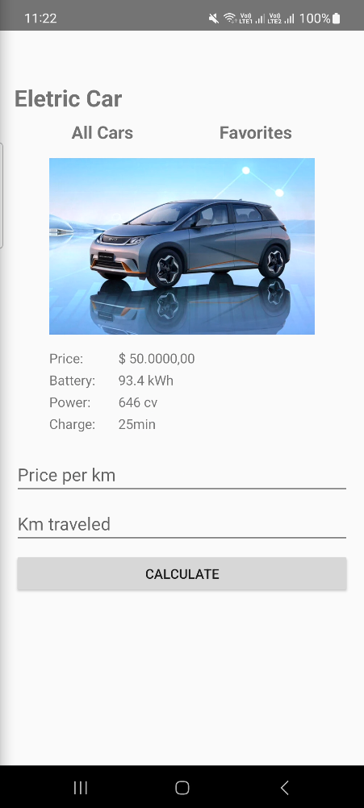
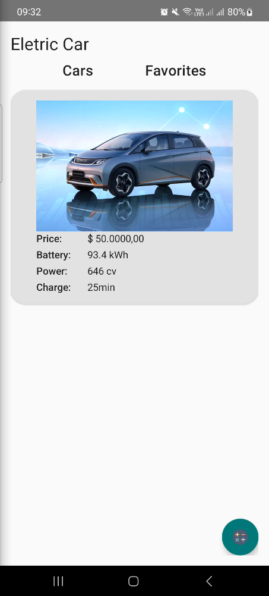
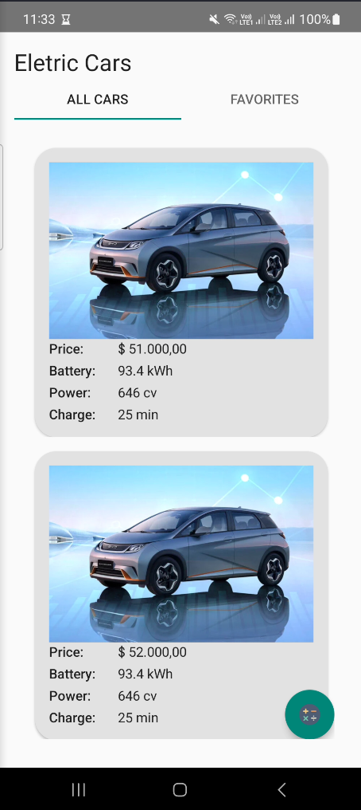

# Eletric Car - Educational Purposes only
App developed during DIO's (Digital Innovation One) Android training

## TO-DO
+ Follow the training path
+ Refactor deprecated async task to an updated Kotlin component
+ Think of more complex functionalities:
    - Login/Logout and Register
    - Admin and common users
    - Admin can register new cars on the system and can access anyone's list of favorite cars
    - Users have their own list of favorite cars
+ Add multi-language support
    - What about strings that needs to be kept secret? Google it

## Step History
+ **Layout closer to the layout's class (01/27/2025)**
    - Final work (for now)

        
    
    - After including edit fields

        

+ **Layout adjustments (01/29/2025)**

    

+ **Insertion of tabs and correction of problems with them (01/30/2025)**

    

    

