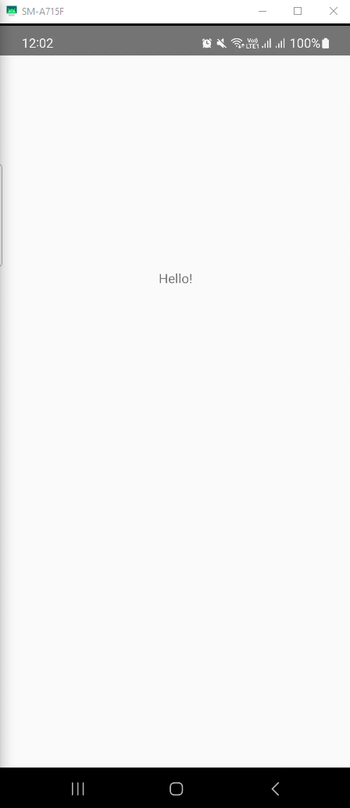
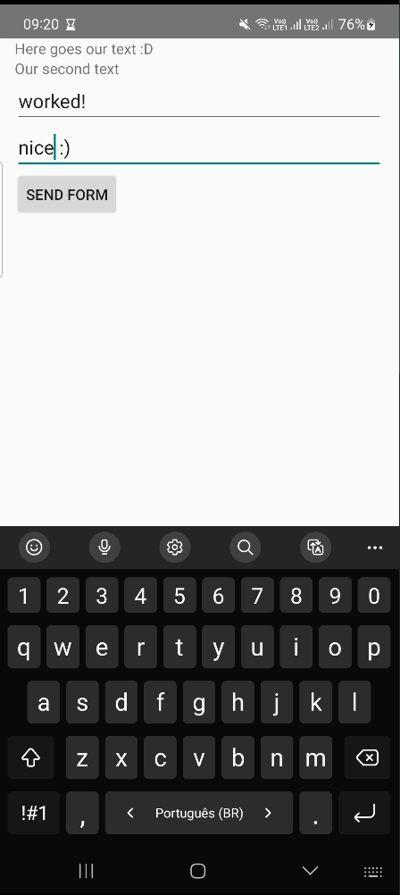
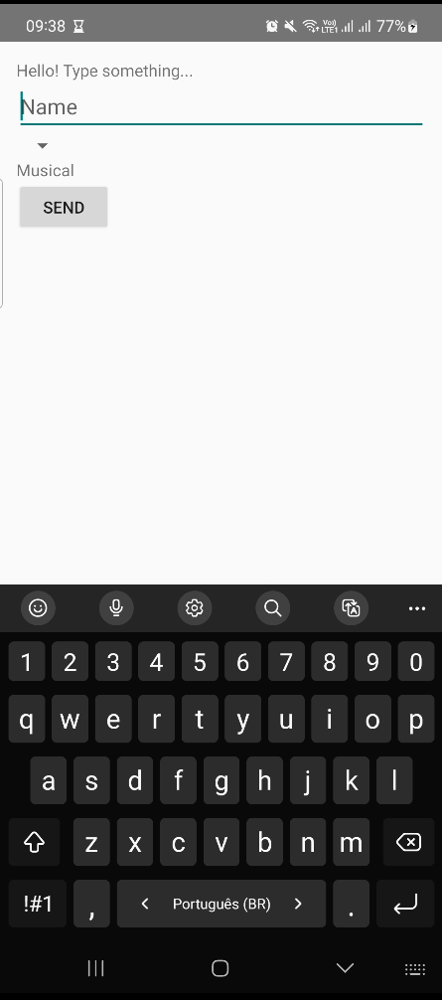
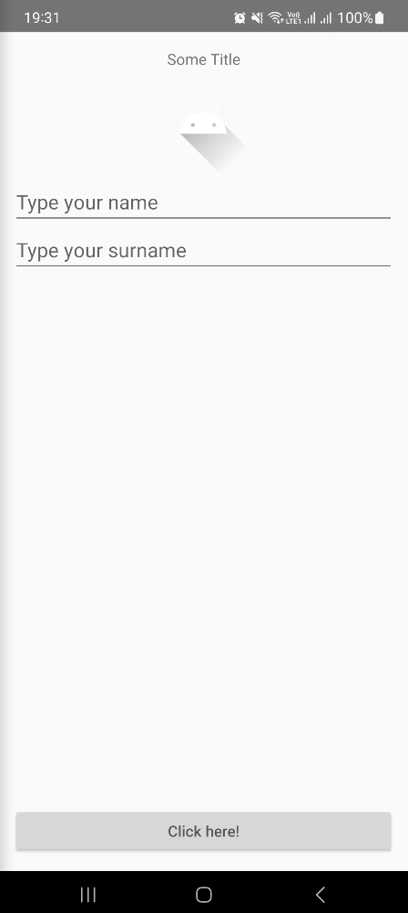

# Eletric Car - Educational Purposes only
App developed during DIO's (Digital Innovation One) Android training

## TO-DO
+ Follow the training path
+ Add multi-language support and put strings on strings.xml file
    - What about strings that needs to be kept secret? Google it

## Step History
+ **Initial step (01/23/2025)**

    

+ **Layout's Classes (01/24/2025)**
    - Linear

        

    - Relative
    
        
    
    - Constraint

        
