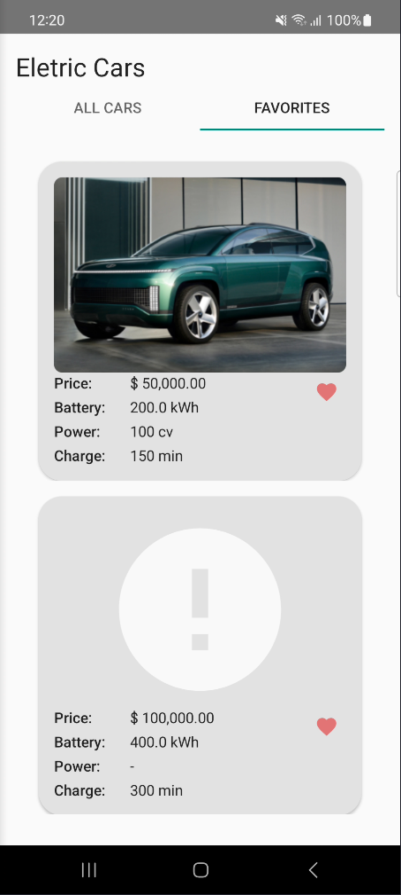

# Eletric Car - Educational Purposes only
App developed during DIO's (Digital Innovation One) Android training

## TO-DO
+ Finish favorites implementation:
    - Refactor it to save on the external database
+ Think of more complex functionalities:
    - Login/Logout and Register
    - Admin and common users
    - Admin can register new cars on the system and can access anyone's list of favorite cars
    - Users have their own list of favorite cars
    - A service that monitors if a new car has been added and updates the list o cars
+ Add multi-language support
    - What about strings that needs to be kept secret? Google it

## PREVIEW

    

